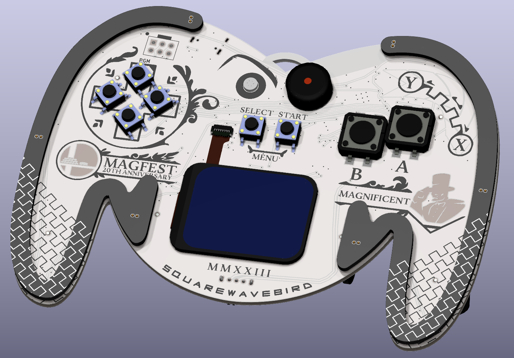
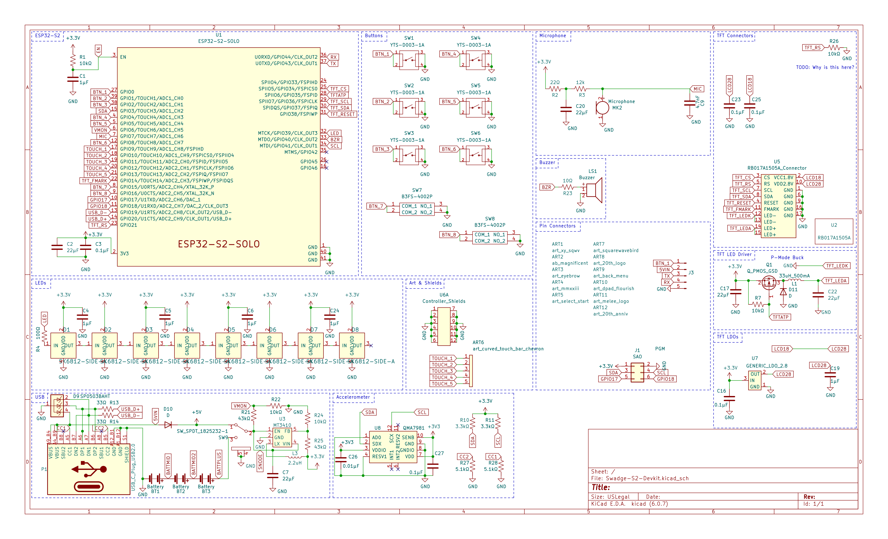

# Super Magfest 2023 Swadge Hardware

## Welcome

This is the hardware repository for the Super Magfest 2022 Swadge.

The corresponding firmware repository for the Super Magfest 2023 Swadge [can be found here](https://github.com/AEFeinstein/Super-2023-Swadge-FW).

If you have any questions, feel free to create a Github ticket or email us at circuitboards@magfest.org.

## Render

## Schematic

## Directories

### `art`
This directory has the SVGs used to generate the KiCad files. The SVGs are drawn in [Inkscape](https://inkscape.org/) and exported with [Svg2Shenzhen](https://github.com/badgeek/svg2shenzhen)
### `SAOs/SAO1`
This directory has the design files for a Simple Add On shaped like Lil'B
### `shield`
This directory has the KiCad project for the PCB shield which protects the LEDs. 
### `shield_l`
This directory has the KiCad project for a test left-side shield which protects the LEDs. It was never manufacturered.
### `shield_r`
This directory has the KiCad project for a test right-side shield which protects the LEDs. It was never manufacturered.
### `Swadge-Parts`
This directory is a git submodule which has all the parts, footprints, and 3D models used in this project.
### `Swadge-S2-Devkit`
This directory has the KiCad project for the main Swadge PCB. It's not really a devkit anymore, but it started out as one!
